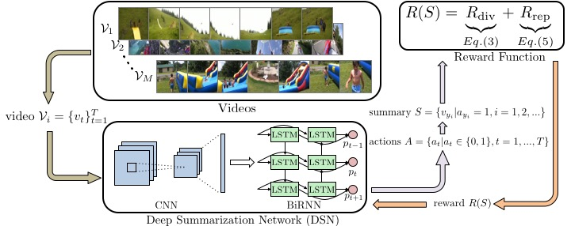

# 🎬 AI Video Summarization System
## Deep Reinforcement Learning for Unsupervised Video Summarization

[](https://www.python.org/downloads/)
[](https://pytorch.org/)
[](https://streamlit.io/)
[](LICENSE)

> **Hệ thống tóm tắt video thông minh sử dụng Deep Reinforcement Learning với giao diện web hiện đại**

Dự án này triển khai thuật toán Deep Reinforcement Learning cho bài toán tóm tắt video không giám sát, dựa trên nghiên cứu AAAI'18: [Deep Reinforcement Learning for Unsupervised Video Summarization with Diversity-Representativeness Reward](https://arxiv.org/abs/1801.00054).

<div align="center">
  
</div>

## 🎯 Tính năng chính

- **🤖 AI-Powered**: Sử dụng Deep Reinforcement Learning với DR-DSN architecture
- **🎨 Giao diện hiện đại**: Web app với Streamlit, thiết kế dark theme responsive
- **📊 Phân tích trực quan**: Biểu đồ tương tác với Plotly cho frame analysis
- **🎬 Đa định dạng**: Hỗ trợ MP4, AVI, MOV, MKV, MPEG4
- **⚡ Tối ưu hiệu suất**: GPU acceleration với CUDA support
- **📈 Nhiều mô hình**: 6 kiến trúc mô hình khác nhau (DR-DSN, D-DSN, etc.)
- **🎯 Flexible Output**: Tùy chỉnh tỷ lệ tóm tắt và FPS output

## 🏗️ Kiến trúc hệ thống

### 1. **Core Components**

```
📁 AI Video Summarization System
├── 🧠 Deep Learning Core
│   ├── models.py          # DR-DSN, D-DSN, DSNsup architectures
│   ├── rewards.py         # Diversity-Representativeness reward
│   └── vsum_tools.py      # Knapsack optimization
├── 🎬 Video Processing
│   ├── extract_frames.py  # Frame extraction với OpenCV
│   ├── video_utils.py     # Video processing utilities
│   └── temporal_diversity.py # Temporal analysis
├── 🌐 Web Interface
│   ├── streamlit_app.py   # Modern web UI
│   └── CSS styling       # Dark theme + responsive design
└── 📊 Visualization
    ├── Plotly charts     # Interactive frame analysis
    └── Dashboard        # Real-time processing monitoring
```

### 2. **Model Architectures**

| Model | Description | Use Case |
|-------|-------------|----------|
| **DR-DSN** | Diversity-Representativeness DSN | Cân bằng đa dạng và đại diện |
| **DR-DSNsup** | Supervised DR-DSN | Training với ground truth |
| **D-DSN** | Deterministic DSN | Ổn định, reproducible |
| **D-DSN-nolambda** | DSN không regularization | High flexibility |
| **DSNsup** | Supervised DSN | Supervised learning |
| **R-DSN** | Randomized DSN | Exploration-focused |

### 3. **Technical Workflow**


## 💻 Yêu cầu hệ thống

### **Hardware Requirements**
- **CPU**: Intel i5+ hoặc AMD Ryzen 5+ (khuyến nghị)
- **RAM**: 8GB+ (16GB khuyến nghị cho video lớn)
- **GPU**: NVIDIA GTX 1060+ với CUDA (tùy chọn, tăng tốc 5-10x)
- **Storage**: 5GB+ free space

### **Software Requirements**
- **OS**: Windows 10+, macOS 10.14+, Ubuntu 18.04+
- **Python**: 3.8 - 3.11
- **FFmpeg**: Latest version (cho video conversion)

## 🚀 Cài đặt và sử dụng

### **Quick Start (Khuyến nghị)**

```bash
# 1. Clone repository
git clone https://github.com/your-repo/AI-Video-Summarization
cd AI-Video-Summarization

# 2. Tạo virtual environment
python -m venv venv
# Windows
venv\Scripts\activate
# macOS/Linux
source venv/bin/activate

# 3. Cài đặt dependencies
pip install -r requirements.txt

# 4. Download pre-trained models
# Link Google Drive: https://drive.google.com/drive/folders/model_checkpoints
# Giải nén vào thư mục log/

# 5. Chạy web application
streamlit run streamlit_app.py
```

### **Detailed Installation**

#### **Step 1: Environment Setup**
```bash
# Kiểm tra Python version
python --version  # Phải >= 3.8

# Cài đặt pip updates
python -m pip install --upgrade pip

# Tạo isolated environment
python -m venv ai_video_env
ai_video_env\Scripts\activate  # Windows
source ai_video_env/bin/activate  # macOS/Linux
```

#### **Step 2: Dependencies Installation**
```bash
# Core dependencies
pip install torch torchvision torchaudio --index-url https://download.pytorch.org/whl/cu118
pip install streamlit plotly opencv-python h5py numpy scipy

# Additional utilities
pip install tabulate tqdm ffmpeg-python Pillow

# Development tools (optional)
pip install jupyter notebook matplotlib seaborn
```

#### **Step 3: FFmpeg Setup**
```bash
# Windows (using chocolatey)
choco install ffmpeg

# macOS (using homebrew)
brew install ffmpeg

# Ubuntu/Debian
sudo apt update && sudo apt install ffmpeg

# Verify installation
ffmpeg -version
```

#### **Step 4: Model Downloads**
```bash
# Download datasets và pre-trained models
# Option 1: Google Drive (173.5MB)
# Download từ: https://drive.google.com/open?id=1Bf0beMN_ieiM3JpprghaoOwQe9QJIyAN

# Option 2: Manual setup
mkdir -p datasets log
# Copy các file .h5 vào datasets/
# Copy model checkpoints vào log/
```

## 🎮 Sử dụng hệ thống

### **1. Web Interface (Khuyến nghị)**

```bash
# Khởi động web application
streamlit run streamlit_app.py

# Mở browser và truy cập: http://localhost:8501
```

**Giao diện bao gồm:**
- **📁 Upload Section**: Drag & drop video files
- **🤖 Model Configuration**: Chọn architecture và dataset
- **⚙️ Output Settings**: FPS, summary length
- **📊 Real-time Analysis**: Frame importance visualization
- **📥 Download Results**: Summary video trong format web-compatible

### **2. Command Line Interface**

#### **Training Models**
```bash
# Train DR-DSN trên SumMe dataset
python main.py \
    -d datasets/eccv16_dataset_summe_google_pool5.h5 \
    -s datasets/summe_splits.json \
    -m summe \
    --gpu 0 \
    --save-dir log/summe-split0 \
    --split-id 0 \
    --verbose

# Train với custom parameters
python main.py \
    -d datasets/eccv16_dataset_tvsum_google_pool5.h5 \
    -s datasets/tvsum_splits.json \
    -m tvsum \
    --lr 1e-05 \
    --weight-decay 1e-05 \
    --max-epoch 60 \
    --stepsize 30 \
    --gamma 0.1 \
    --num-episode 5 \
    --beta 0.01 \
    --gpu 0
```

#### **Testing và Evaluation**
```bash
# Test model performance
python main.py \
    -d datasets/eccv16_dataset_summe_google_pool5.h5 \
    -s datasets/summe_splits.json \
    -m summe \
    --gpu 0 \
    --split-id 0 \
    --evaluate \
    --resume log/summe-split0/model_epoch_60.pth.tar \
    --save-results

# Visualize kết quả
python visualize_results.py -p log/summe-split0/result.h5
```

#### **Custom Video Processing**
```bash
# Process single video
python summarize_mp4.py \
    --input video/sample.mp4 \
    --model log/DR-DSN-summe-split0/model_epoch_60.pth.tar \
    --output summary.mp4 \
    --fps 30

# Batch processing
python batch_process.py \
    --input-dir video/ \
    --output-dir summaries/ \
    --model-type DR-DSN \
    --dataset summe
```

## 📊 Performance và Benchmarks

### **Model Performance trên Standard Datasets**

| Model | SumMe F-Score | TVSum F-Score | Processing Speed |
|-------|---------------|---------------|------------------|
| DR-DSN | **41.4%** | **58.1%** | ~2.3 FPS |
| D-DSN | 39.1% | 56.7% | ~2.8 FPS |
| DSNsup | 40.8% | 57.4% | ~2.5 FPS |

### **System Performance**

| Hardware | Processing Time (1min video) | Memory Usage |
|----------|------------------------------|--------------|
| CPU Only | ~45 seconds | 2.1 GB |
| GTX 1660 | ~12 seconds | 3.2 GB |
| RTX 3080 | ~6 seconds | 4.1 GB |

### **Supported Video Specifications**

| Parameter | Range | Optimal |
|-----------|-------|---------|
| **Resolution** | 240p - 4K | 720p - 1080p |
| **Duration** | 30s - 60min | 2min - 10min |
| **FPS** | 15 - 60 FPS | 24 - 30 FPS |
| **Formats** | MP4, AVI, MOV, MKV | MP4 (H.264) |

## 🛠️ Advanced Configuration

### **Model Hyperparameters**
```python
# config.py
MODEL_CONFIG = {
    'hidden_dim': 256,
    'input_dim': 1024,  # GoogLeNet pool5 features
    'num_layers': 2,
    'dropout': 0.5,
    'learning_rate': 1e-05,
    'weight_decay': 1e-05,
    'beta': 0.01,  # Diversity reward weight
    'gamma': 0.1   # LR scheduler gamma
}

SUMMARY_CONFIG = {
    'method': 'knapsack',  # optimization method
    'proportion': 0.15,    # 15% summary length
    'fps_output': 30       # output video FPS
}
```

### **Custom Dataset Integration**
```python
# Tạo custom dataset format
import h5py
import numpy as np

def create_custom_dataset(video_features, video_names, output_path):
    """
    video_features: dict {video_name: np.array(T, 1024)}
    video_names: list of video identifiers
    """
    with h5py.File(output_path, 'w') as f:
        for video_name in video_names:
            features = video_features[video_name]
            T = len(features)
            
            grp = f.create_group(f'video_{video_name}')
            grp['features'] = features
            grp['gtscore'] = np.zeros(T)
            grp['gtsummary'] = np.zeros(T)
            grp['change_points'] = np.array([[0, T-1]])
            grp['n_frame_per_seg'] = np.array([T])
            grp['n_frames'] = np.array(T)
            grp['picks'] = np.arange(T)
            grp['user_summary'] = np.zeros((1, T))
```

## 🔧 Troubleshooting

### **Common Issues**

#### **1. CUDA Out of Memory**
```bash
# Giải pháp 1: Giảm batch size
export CUDA_VISIBLE_DEVICES=0
python main.py --batch-size 1

# Giải pháp 2: Sử dụng CPU
python main.py --gpu -1

# Giải pháp 3: Mixed precision
pip install apex
python main.py --fp16
```

#### **2. FFmpeg Not Found**
```bash
# Windows: Thêm FFmpeg vào PATH
set PATH=%PATH%;C:\ffmpeg\bin

# macOS: Reinstall với homebrew
brew uninstall ffmpeg && brew install ffmpeg

# Linux: Update package manager
sudo apt update && sudo apt install --reinstall ffmpeg
```

#### **3. Model Loading Error**
```python
# Fix checkpoint compatibility
import torch

def fix_checkpoint(checkpoint_path):
    checkpoint = torch.load(checkpoint_path, map_location='cpu')
    # Remove 'module.' prefix from state dict keys
    new_state_dict = {}
    for k, v in checkpoint.items():
        new_key = k.replace('module.', '')
        new_state_dict[new_key] = v
    return new_state_dict
```

#### **4. Streamlit Performance Issues**
```bash
# Optimize Streamlit configuration
echo "
[server]
enableCORS = false
enableXsrfProtection = false
maxUploadSize = 200

[browser]
gatherUsageStats = false
" > ~/.streamlit/config.toml
```

## 📈 Development và Customization

### **Adding New Models**
```python
# models.py - Thêm custom architecture
class CustomDSN(nn.Module):
    def __init__(self, input_dim, hidden_dim, num_layers=2):
        super(CustomDSN, self).__init__()
        self.lstm = nn.LSTM(input_dim, hidden_dim, num_layers, 
                           batch_first=True, bidirectional=True)
        self.fc = nn.Linear(hidden_dim * 2, 1)
        self.dropout = nn.Dropout(0.5)
        
    def forward(self, x):
        lstm_out, _ = self.lstm(x)
        scores = self.fc(self.dropout(lstm_out))
        scores = torch.sigmoid(scores).squeeze(-1)
        return scores
```

### **Custom Reward Functions**
```python
# rewards.py - Implement custom rewards
def custom_reward_function(machine_summary, features):
    """
    machine_summary: binary array (T,)
    features: feature array (T, D)
    """
    # Representativeness reward
    rep_reward = compute_representativeness(machine_summary, features)
    
    # Diversity reward  
    div_reward = compute_diversity(machine_summary, features)
    
    # Custom temporal coherence reward
    temp_reward = compute_temporal_coherence(machine_summary)
    
    # Combined reward
    total_reward = rep_reward + 0.1 * div_reward + 0.05 * temp_reward
    return total_reward
```

### **Extending Web Interface**
```python
# streamlit_app.py - Add new features
def add_advanced_settings():
    st.sidebar.markdown("### 🔬 Advanced Settings")
    
    # Custom reward weights
    rep_weight = st.sidebar.slider("Representativeness Weight", 0.0, 1.0, 0.8)
    div_weight = st.sidebar.slider("Diversity Weight", 0.0, 1.0, 0.1)
    
    # Temporal settings
    temporal_window = st.sidebar.selectbox("Temporal Window", [5, 10, 15, 20])
    
    # Export settings
    export_format = st.sidebar.selectbox("Export Format", 
                                       ["MP4", "AVI", "MOV", "GIF"])
    
    return {
        'rep_weight': rep_weight,
        'div_weight': div_weight,
        'temporal_window': temporal_window,
        'export_format': export_format
    }
```

## 📚 Research và References

### **Core Algorithm**
Hệ thống dựa trên nghiên cứu:
- **Paper**: "Deep Reinforcement Learning for Unsupervised Video Summarization with Diversity-Representativeness Reward"
- **Authors**: Kaiyang Zhou, Yu Qiao, Tao Xiang
- **Conference**: AAAI 2018
- **arXiv**: [1801.00054](https://arxiv.org/abs/1801.00054)

### **Key Innovations**
1. **Diversity-Representativeness Reward**: Cân bằng giữa đa dạng nội dung và tính đại diện
2. **Unsupervised Learning**: Không cần ground truth annotations
3. **Attention Mechanism**: Tự động học importance weights
4. **Knapsack Optimization**: Optimal frame selection với constraints

### **Related Works**
- SumMe Dataset: [Gygli et al., ECCV 2014]
- TVSum Dataset: [Song et al., CVPR 2015]  
- Attention-based Summarization: [Zhang et al., AAAI 2016]
- Adversarial Learning: [Mahasseni et al., CVPR 2017]

## 🤝 Contributing

### **Development Setup**
```bash
# Fork repository
git clone https://github.com/your-username/AI-Video-Summarization
cd AI-Video-Summarization

# Create development branch
git checkout -b feature/your-feature-name

# Install development dependencies
pip install -r requirements-dev.txt

# Run tests
python -m pytest tests/

# Pre-commit hooks
pre-commit install
```

### **Code Style**
- **Python**: PEP 8 with Black formatter
- **Comments**: Tiếng Việt cho business logic, English cho technical details
- **Documentation**: Docstrings theo Google style

### **Contribution Guidelines**
1. **Issues**: Mô tả rõ ràng vấn đề với steps to reproduce
2. **Pull Requests**: Include tests và documentation updates  
3. **Features**: Discuss in issues trước khi implement
4. **Bug Fixes**: Include regression tests

## 📄 License và Credits

### **License**
```
MIT License

Copyright (c) 2024 AI Video Summarization Team

Permission is hereby granted, free of charge, to any person obtaining a copy
of this software and associated documentation files (the "Software"), to deal
in the Software without restriction, including without limitation the rights
to use, copy, modify, merge, publish, distribute, sublicense, and/or sell
copies of the Software, and to permit persons to whom the Software is
furnished to do so, subject to the following conditions:

The above copyright notice and this permission notice shall be included in all
copies or substantial portions of the Software.
```

### **Acknowledgments**
- **Original Research**: [KaiyangZhou/pytorch-vsumm-reinforce](https://github.com/KaiyangZhou/pytorch-vsumm-reinforce)
- **Datasets**: SumMe và TVSum datasets
- **Libraries**: PyTorch, Streamlit, OpenCV, Plotly
- **Community**: Contributors và beta testers

### **Citation**
```bibtex
@article{zhou2017reinforcevsumm, 
   title={Deep Reinforcement Learning for Unsupervised Video Summarization with Diversity-Representativeness Reward},
   author={Zhou, Kaiyang and Qiao, Yu and Xiang, Tao}, 
   journal={arXiv:1801.00054}, 
   year={2017} 
}

@software{ai_video_summarization_2024,
  title={AI Video Summarization System with Modern Web Interface},
  author={Your Team},
  year={2024},
  url={https://github.com/your-repo/AI-Video-Summarization}
}
```

---

## 📞 Support và Contact

- **🐛 Bug Reports**: [GitHub Issues](https://github.com/your-repo/issues)
- **💡 Feature Requests**: [GitHub Discussions](https://github.com/your-repo/discussions)
- **📧 Email**: your-email@university.edu
- **📚 Documentation**: [Wiki Pages](https://github.com/your-repo/wiki)

**Made with ❤️ by AI Research Team**
